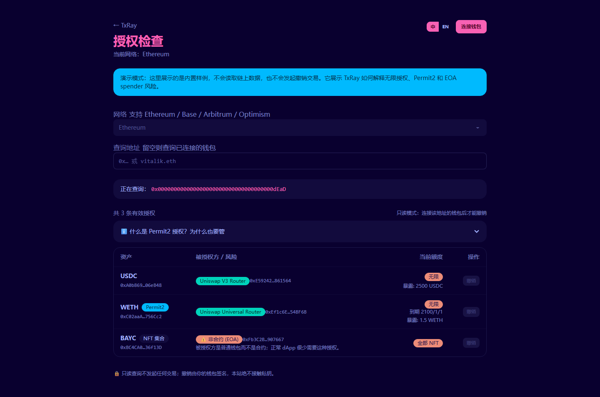
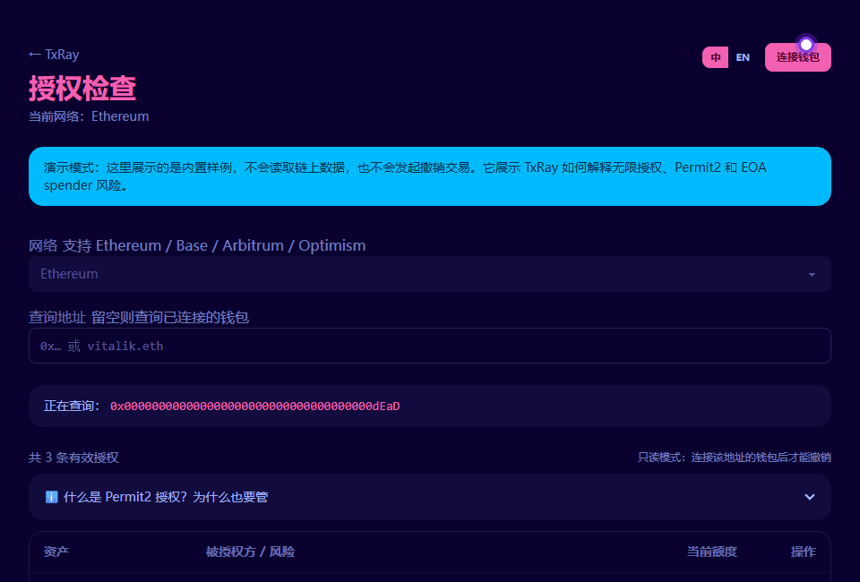

# TxRay — Web3 Approval & Transaction Risk Explorer

**Languages:** [中文](./README.md) | English

[](https://sophran-tools.vercel.app/tools/txray)
[](https://sophran-tools.vercel.app/tools/txray/approvals?demo=1)
[](https://github.com/Sophran-fbj/sophran-tools/actions/workflows/ci.yml)
[](./LICENSE)

> Inspect ERC-20, NFT, and Permit2 approvals, decode transactions and EIP-712 signatures, and understand every risk in plain language.

> [!IMPORTANT]
> **Safety boundary:** Read-only by default. Demo mode uses built-in samples—it never connects to a wallet, reads an address, or sends a transaction. Revokes require explicit confirmation in the user's wallet; the site never handles seed phrases or private keys.



<p align="center"><strong>20-second walkthrough: inspect approvals and decode a transaction without connecting a wallet</strong></p>
<p align="center"></p>

TxRay is the onchain-security product within Sophran Tools. It currently includes **Approval Check**, **Transaction Decoder**, and **Signature Risk** for token permissions, calldata / transaction input, and EIP-712 signing risk.

These tools focus on practical user safety: wallet connection, indexed chain data, RPC reads, multicall, calldata decoding, Permit2 allowance analysis, EIP-712 typed-data inspection, and plain-language risk explanation.

## Why This Project Exists

Many wallet and explorer tools show raw warnings, but users often still do not understand what they are approving or signing.

TxRay focuses on **detect + explain**:

- Detect risky token approvals and Permit2 allowances.
- Decode calldata and common dangerous function selectors.
- Explain risks in plain language and link each risk back to educational articles.

## Current Features

### TxRay · Approval Check

- Read ERC-20, ERC-721, and Permit2 approval history through a server-side Etherscan indexer route; explicitly mark results incomplete when the pagination budget is reached.
- Verify current allowances with chunked viem multicalls, filtering stale approvals without creating oversized RPC requests.
- Detect unlimited ERC-20 allowances.
- Detect NFT `setApprovalForAll` collection-level approvals.
- Inspect Uniswap Permit2 internal allowances.
- Support Ethereum, Base, Arbitrum, and Optimism.
- Estimate `$ at risk` with `min(current balance, allowance)`, and convert it to USD through CoinGecko when pricing is available.
- Classify spender risk:
  - known trusted contracts,
  - EOA spenders,
  - newly deployed unknown contracts,
  - unknown contracts,
  - chain-scoped known-contract labels;
  - Scam Sniffer public malicious-address intelligence (updated daily with an approximately 7-day public-data delay); failures degrade explicitly, and unknown never means safe.
- Revoke ERC-20, NFT, and Permit2 approvals after enforcing the target chain and simulating the write.
- Demo mode: `/tools/txray/approvals?demo=1`.

### TxRay · Transaction Decoder

- Decode calldata directly.
- Fetch and decode transaction input on the selected Ethereum, Base, Arbitrum, or Optimism network.
- Recognize common selectors such as `approve`, `setApprovalForAll`, `permit`, `transferFrom`, and `transfer`.
- Highlight high-risk calls and explain what the function can authorize.
- Fallback to an OpenChain signature lookup for unknown selectors.

### Signature Risk · EIP-712 Signature Risk Explainer

- Paste typed-data JSON from a wallet signing prompt.
- Recognize ERC-20 `permit`, Permit2 typed data, and order-style signatures.
- Extract security-relevant fields:
  - spender/operator,
  - token,
  - amount,
  - deadline/expiration,
  - verifying contract,
  - nonce.
- Flag unlimited amounts and long-lived signatures.
- Fully read-only: it never asks the wallet to sign anything.

### Articles

- `/articles/why-unlimited-approval-is-dangerous`
- `/articles/permit2-eip712-phishing`

The site supports Chinese and English through a lightweight local i18n provider.

## Technical Stack

| Layer | Choice |
|---|---|
| Framework | Next.js 16 App Router + React 19 |
| Language | TypeScript |
| Wallet | RainbowKit 2 |
| Chain interaction | wagmi 2 + viem 2 |
| Query/cache | TanStack Query |
| UI | Tailwind CSS 4 + DaisyUI 5 |
| Tests | Vitest + Playwright |
| Package manager | pnpm |

## Architecture

Single Next.js app. Tools are routes; business logic lives under `src/features`.

```text
src/
├─ app/
│  ├─ tools/txray/          # TxRay routes
│  ├─ articles/             # educational articles
│  └─ api/                  # server-side indexer/signature helper routes
├─ components/              # shared UI components
├─ content/articles.ts      # lightweight article content registry
├─ features/txray/          # approval and transaction decoder logic
├─ features/signature-risk/ # EIP-712 signature analysis logic
└─ lib/
   ├─ i18n/                 # local bilingual text provider
   └─ web3/                 # wagmi / viem configuration
```

The project deliberately avoids monorepo complexity for now. There is only one deployable app, so shared code is regular project-level imports. If another independently deployed app appears later, this structure can be promoted to a workspace.

## Data Flow

| Data | Where it runs | Why |
|---|---|---|
| Approval history | Server route -> Etherscan indexer | Full-history `eth_getLogs` is impractical on free RPC plans. |
| Current allowance / metadata | Browser -> viem multicall | Live chain state; no private server state needed. |
| Spender creation info | Server route -> Etherscan | Keeps API key server-side. |
| Calldata decoding | Browser + signature lookup route | Local known selector map first, fallback to OpenChain. |
| EIP-712 analysis | Browser only | Pure JSON inspection; no RPC or signing required. |
| Token prices | Browser -> CoinGecko | Used only for `$ at risk`; falls back to token amount if pricing fails. |

## Security Posture

- Never asks for a seed phrase or private key.
- Read-only analysis by default.
- Write operations are limited to revoke transactions initiated through the user's wallet.
- Etherscan API key stays server-side.
- Wallet addresses are not persisted or profiled. Approval and contract-info routes process query addresses transiently and send query parameters to Etherscan; RPC and CoinGecko requests are also subject to those providers' privacy policies.
- Malicious-address checks periodically download Scam Sniffer's complete public list on the server and match locally; queried user addresses are not sent to the intelligence provider.
- WalletConnect and Alchemy public keys are frontend keys and should be domain-restricted in provider dashboards.

## Local Development

```bash
pnpm install
cp .env.example .env.local
pnpm dev
```

Required environment variables:

| Variable | Purpose |
|---|---|
| `NEXT_PUBLIC_WC_PROJECT_ID` | Reown / WalletConnect Project ID for RainbowKit |
| `NEXT_PUBLIC_ALCHEMY_ID` | Alchemy RPC key |
| `ETHERSCAN_API_KEY` | Etherscan V2 API key used by server routes |
| `DEV_PROXY` | Optional local HTTP/mixed proxy for mainland-China development |

Example `DEV_PROXY`:

```env
DEV_PROXY=http://127.0.0.1:10808
```

Without `NEXT_PUBLIC_WC_PROJECT_ID`, local builds still work with injected browser wallets only. Production should provide a real, domain-restricted Project ID.

## Known Limitations

- Etherscan log scans are capped at 10,000 records per event class. Reaching the cap produces an explicit incomplete-scan warning and never a clean result.
- Trusted spender labels currently apply only to Ethereum mainnet; other chains default to unknown.
- Signature Risk expands structures and arrays from EIP-712 `types`. Without a schema, it performs conservative field scanning and displays a limitation warning.

## Verification

```bash
pnpm lint
pnpm typecheck
pnpm test
pnpm build
pnpm e2e
```

Run `pnpm exec playwright install chromium` before the first E2E run. GitHub Actions runs the same checks on pushes and pull requests.

## Next Steps

- Add more real spender labels and a public drainer/blocklist source.
- Add more chains after Ethereum / Base / Arbitrum / Optimism are stable.
- Improve `$ at risk` caching and token price coverage.
- Improve article authoring with MDX once content grows.

## License

[MIT](./LICENSE)


